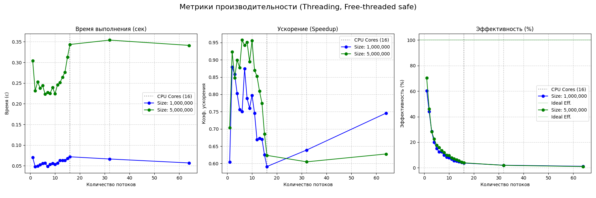
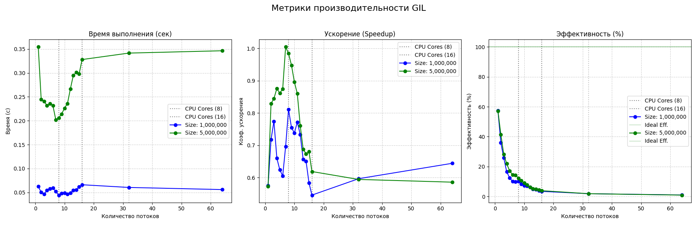

# Лабораторная работа №1  
## "Параллельные вычисления и пределы масштабирования"

**Вариант:** Подсчет количества отличий между двух массивов

**Язык реализации:** Python 3.14+ (free-threaded build)

---

## 1. Описание задачи

Необходимо реализовать подсчёт количества позиций, на которых элементы двух массивов различаются. Задача имеет embarrassingly parallel характер — каждый элемент массива может быть обработан независимо.

### Формула
```
result = Σ(a[i] ≠ b[i]) для i от 0 до N-1
```

---

## 2. Распараллеливание задачи

### Как можно распараллелить

Задача идеально подходит для распараллеливания методом **разделения данных (data parallelism)**:

1. **Разбиение массива:** Исходные массивы делятся на K равных частей (chunks), где K — количество рабочих единиц (потоков или процессов)
2. **Независимая обработка:** Каждый рабочий обрабатывает свой диапазон индексов `[l, r)` независимо
3. **Агрегация результатов:** Итоговый результат получается суммированием частичных результатов

### Что можно распараллелить

| Часть задачи | Можно ли распараллелить | Обоснование |
|--------------|------------------------|-------------|
| Сравнение элементов массива | Да | Каждый элемент обрабатывается независимо |
| Подсчёт различий в диапазоне | Да | Диапазоны не пересекаются |
| Финальное суммирование | Частично | Требует синхронизации, но операция быстрая |

### Что нельзя распараллелить

| Часть задачи | Почему нельзя |
|--------------|---------------|
| Генерация входных данных | Последовательная зависимость по индексу |
| Финальное суммирование результатов | Требует последовательного доступа к общим данным |
| Выделение памяти под массивы | Операция управления памятью |

---

## 3. Реализация

### Структура файлов

| Файл | Описание |
|------|----------|
| `parallel_compare.py` | Базовая реализация: последовательная версия, threading и multiprocessing подходы |
| `benchmark.py` | Полное тестирование: детерминизм, замеры производительности, построение графиков |

### Подходы к распараллеливанию

#### 3.1. Последовательная версия (Sequential)

```python
def run_sequential(a, b):
    return sum(a[i] != b[i] for i in range(len(a)))
```

**Преимущества:**
- Отсутствие накладных расходов на синхронизацию
- Оптимальное использование кэша процессора
- Предсказуемое поведение

**Недостатки:**
- Использование только одного ядра CPU

#### 3.2. Многопоточная версия (Threading)

```python
def run_threaded(a, b, num_threads=4):
    # Разделение на chunks
    # Создание потоков для каждого диапазона
    # Агрегация результатов
```

**Особенности реализации:**
- Массив делится на `num_threads` равных частей
- Каждый поток обрабатывает свой диапазон `[l, r)`
- Результаты записываются в общий список по индексу потока
- Используется `threading.Thread` для создания рабочих потоков

**Преимущества:**
- Лёгкость создания потоков
- Общая память (не требуется копирование данных)

**Недостатки:**
- Ограничение GIL (Global Interpreter Lock) в стандартном CPython
- Накладные расходы на переключение контекста

#### 3.3. Многопроцессорная версия (Multiprocessing)

```python
def run_multiprocessed(a, b, num_processes=4):
    # Создание пула процессов
    # Распределение задач через pool.map()
    # Агрегация результатов
```

**Особенности реализации:**
- Используется `multiprocessing.Pool` для управления процессами
- Данные передаются между процессами через pickle-сериализацию
- Каждый процесс работает в своём адресном пространстве

**Преимущества:**
- Обход GIL (каждый процесс имеет свой интерпретатор)
- Истинный параллелизм на уровне ядер CPU

**Недостатки:**
- Значительные накладные расходы на создание процессов
- Передача данных через IPC (межпроцессное взаимодействие)
- Сериализация/десериализация больших массивов

---

## 4. Экспериментальная часть

### 4.1. Тест на детерминизм

**Цель:** Подтвердить, что параллельная версия выдаёт одинаковые результаты при множественных запусках.

**Параметры:**
- Количество итераций: N = 105
- Размер массива: 100,000 элементов
- Количество потоков: 4

**Результаты для обеих версий Python:**

| Python версия | Результат теста |
|---------------|-----------------|
| 3.14 free-threaded | `[OK] Детерминизм подтвержден. Все 105 запусков вернули результат: 50000` |
| 3.14 с GIL | `[OK] Детерминизм подтвержден. Все 105 запусков вернули результат: 50000` |

**Вывод:** Параллельная версия полностью детерминирована в обоих случаях благодаря тому, что:
- Каждый поток работает с непересекающимся диапазоном данных
- Отсутствует состояние гонки (race condition) при записи результатов
- Используется детерминированная генерация данных

### 4.2. Сравнение подходов (Sequential vs Threading vs Multiprocessing)

**Параметры эксперимента:**
- Размер данных: 5,000,000 элементов
- Количество рабочих единиц: 8

**Результаты:**

| Подход | Результат | Время (с) | Ускорение | Эффективность |
|--------|-----------|-----------|-----------|---------------|
| Sequential | 2,500,000 | 0.3272 | 1.00x | 100.0% |
| Threading | 2,500,000 | 0.7691 | 0.43x | 5.3% |
| Multiprocessing | 2,500,000 | 6.4878 | 0.05x | 0.6% |

**Вывод:** Оба параллельных подхода показали результат **хуже** последовательной версии.

### 4.3. Эксперименты по масштабированию

**Параметры эксперимента:**
- Доступно ядер CPU: 16
- Конфигурации потоков: 1, 2, ..., 16, 32, 64
- Размеры данных: 1,000,000 и 5,000,000 элементов
- Количество повторений: 3 для каждого измерения

#### Результаты для Python 3.14 free-threaded

**Размер 1,000,000 элементов:**

| Потоки | Время (с) | Ускорение | Эффективность |
|--------|-----------|-----------|---------------|
| 1 | 0.0655 | 0.53x | 53.2% |
| 2 | 0.0509 | 0.68x | 34.2% |
| 4 | 0.0500 | 0.70x | 17.4% |
| 8 | 0.0523 | 0.67x | 8.3% |
| 16 | 0.0746 | 0.47x | 2.9% |

**Размер 5,000,000 элементов:**

| Потоки | Время (с) | Ускорение | Эффективность |
|--------|-----------|-----------|---------------|
| 1 | 0.3078 | 0.62x | 62.1% |
| 2 | 0.2269 | 0.84x | 42.1% |
| 4 | 0.2307 | 0.83x | 20.7% |
| 8 | 0.2121 | 0.90x | 11.3% |
| 16 | 0.3344 | 0.57x | 3.6% |

**Наблюдения:**
- Лучшее ускорение (0.90x) достигнуто при 8 потоках для больших данных
- При превышении количества физических ядер (16) эффективность падает до ~1%
- Увеличение размера данных улучшает ускорение (с 0.70x до 0.90x при 8 потоках)

#### Результаты для Python 3.14 с GIL

**Размер 5,000,000 элементов (ключевые точки):**

| Потоки | Время (с) | Ускорение | Эффективность |
|--------|-----------|-----------|---------------|
| 1 | 0.3542 | 0.57x | 57.3% |
| 4 | 0.2318 | 0.88x | 21.9% |
| 7 | 0.2021 | 1.00x | 14.3% |
| 8 | 0.2062 | 0.98x | 12.3% |
| 16 | 0.3280 | 0.62x | 3.9% |

**Наблюдения:**
- При 7-8 потоках достигнуто ускорение ~1.00x (паритет с sequential)
- GIL не позволяет получить суперлинейное ускорение
- После 8 потоков эффективность резко падает

#### Графики производительности



*Рисунок 1 — Python 3.14 free-threaded: время, ускорение и эффективность*



*Рисунок 2 — Python 3.14 с GIL: время, ускорение и эффективность*

---

## 5. Анализ результатов

### 5.1. Почему multiprocessing показал наихудший результат

**От многопроцессорного подхода следует отказаться** по следующим причинам:

1. **Накладные расходы на создание процессов**
   - Создание процесса в ~100 раз дороже создания потока
   - Для 8 процессов время создания может достигать десятков миллисекунд

2. **Сериализация данных (pickle)**
   - Передача двух массивов по 5,000,000 элементов требует сериализации
   - Время на pickle.dumps()/pickle.loads() доминирует над временем вычислений

3. **Дублирование памяти**
   - Каждый процесс получает копию данных в своём адресном пространстве
   - Потребление памяти: O(K × N), где K — количество процессов

4. **IPC-накладные расходы**
   - Передача результатов через Queue/Pipe
   - Синхронизация между родительским и дочерними процессами

**Вывод:** Для простых задач с большими объёмами данных multiprocessing неэффективен из-за доминирования накладных расходов над полезной работой.

### 5.2. Сравнение free-threaded и GIL версий

| Характеристика | Python free-threaded | Python с GIL |
|----------------|---------------------|--------------|
| Лучшее ускорение (5M элементов) | 0.90x (8 потоков) | 1.00x (7 потоков) |
| Эффективность при 8 потоках | 11.3% | 12.3% |
| Время sequential | 0.1911 с | 0.2030 с |

**Ключевые наблюдения:**

1. **GIL-версия показала паритет с sequential** при 7-8 потоках (ускорение ~1.00x)
   - Это связано с тем, что операция сравнения очень быстрая
   - GIL переключает потоки, но overhead переключения меньше, чем overhead синхронизации в free-threaded

2. **Free-threaded версия не достигла паритета** (максимум 0.90x)
   - Механизмы fine-grained locking для защиты объектов
   - Синхронизация ссылочных счётчиков в многопоточной среде
   - Координация сборщика мусора между потоками

3. **Обе версии деградируют после MAX(CPU)**
   - При 16+ потоках начинается конкуренция за физические ядра
   - При 32-64 потоках эффективность падает до 1-2%

### 5.3. Влияние GIL на производительность threading

**Стандартный CPython (с GIL):**

В стандартной реализации Python Global Interpreter Lock (GIL) позволяет выполняться **только одному потоку одновременно**:

- Потоки не работают истинно параллельно
- Переключение между потоками происходит каждые ~5ms
- Для CPU-bound задач threading показывает результат **хуже** sequential

**Python free-threaded (без GIL):**

В эксперименте использовалась специальная сборка Python 3.14+ без GIL:

- Потоки могут выполняться истинно параллельно на разных ядрах
- Однако наблюдаются **дополнительные накладные расходы**:
  - Механизмы fine-grained locking для защиты объектов
  - Синхронизация ссылочных счётчиков
  - Координация сборщика мусора

### 5.4. Почему параллельные версии медленнее последовательной

**Основная причина:** Задача слишком простая (trivial computation)

| Фактор | Влияние |
|--------|---------|
| **Сложность операции** | Сравнение двух integers — одна CPU-инструкция |
| **Время на элемент** | ~0.1 наносекунды на сравнение |
| **Накладные расходы** | Создание потока: ~1 мкс, переключение: ~100 нс |
| **Соотношение** | Накладные расходы > время полезной работы |

**Математическое обоснование:**

Для массива из 5,000,000 элементов:
- Последовательное время: ~0.33 с
- Время на элемент: 0.33 / 5,000,000 ≈ 66 нс
- Накладные расходы на поток: ~1000 нс

При 8 потоках:
- Полезная работа на поток: 625,000 × 66 нс ≈ 41,250 нс
- Накладные расходы: 1000 нс (создание) + переключения
- **Итого:** экономия времени не компенсирует overhead

### 5.5. Когда распараллеливание было бы эффективным

Распараллеливание дало бы ускорение при условиях:

1. **Более сложная операция на элемент**
   - Криптографические вычисления
   - Матричные операции
   - Сложные математические функции (sin, cos, exp)

2. **Больший объём данных**
   - При N > 100,000,000 элементов накладные расходы становятся менее значимыми

3. **I/O-операции**
   - Чтение/запись файлов
   - Сетевые запросы
   - Работа с базой данных

---

## 6. Выводы

1. **GIL является основным ограничением** для многопоточности в стандартном CPython для CPU-bound задач.

2. **Python free-threaded** позволяет обойти GIL, но вносит дополнительные накладные расходы на синхронизацию.

3. **Multiprocessing неэффективен** для простых задач с большими данными из-за:
   - Высокой стоимости создания процессов
   - Накладных расходов на сериализацию
   - Потребления памяти O(K × N)

4. **Распараллеливание тривиальных операций** (сравнение integers) не даёт ускорения при размерах данных до 5,000,000 элементов — накладные расходы превышают полезную работу.

5. **Для эффективного распараллеливания** необходимо:
   - Достаточно сложное вычисление на элемент
   - Минимизация передачи данных между рабочими единицами
   - Баланс между гранулярностью задач и overhead

---

