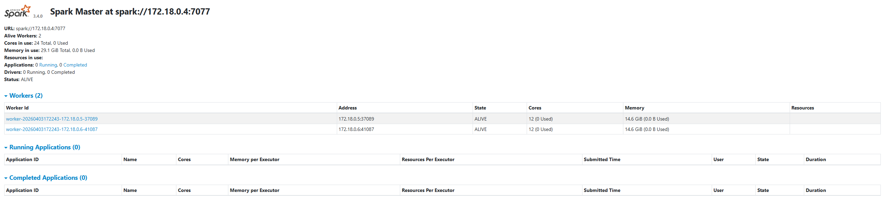
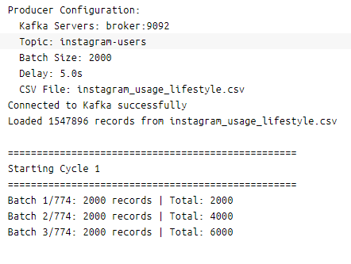
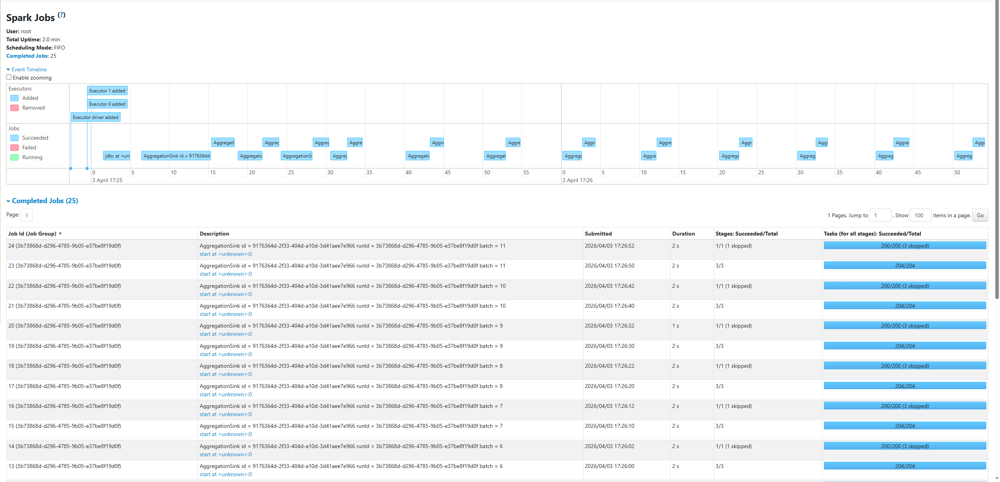
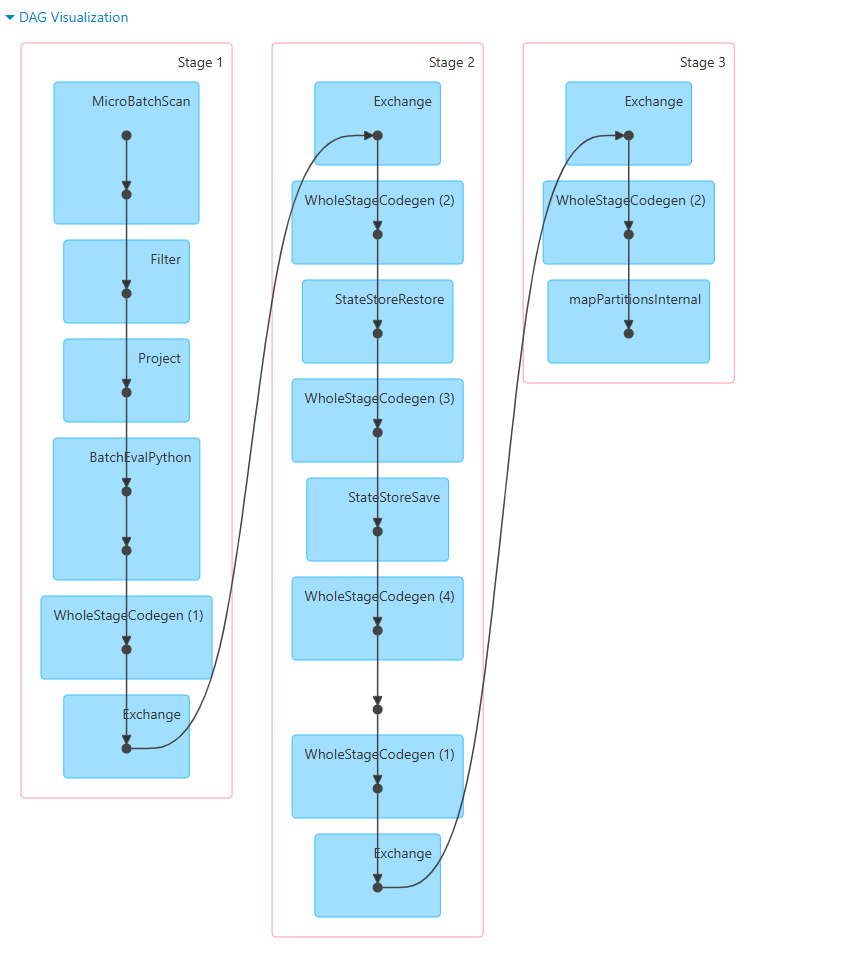
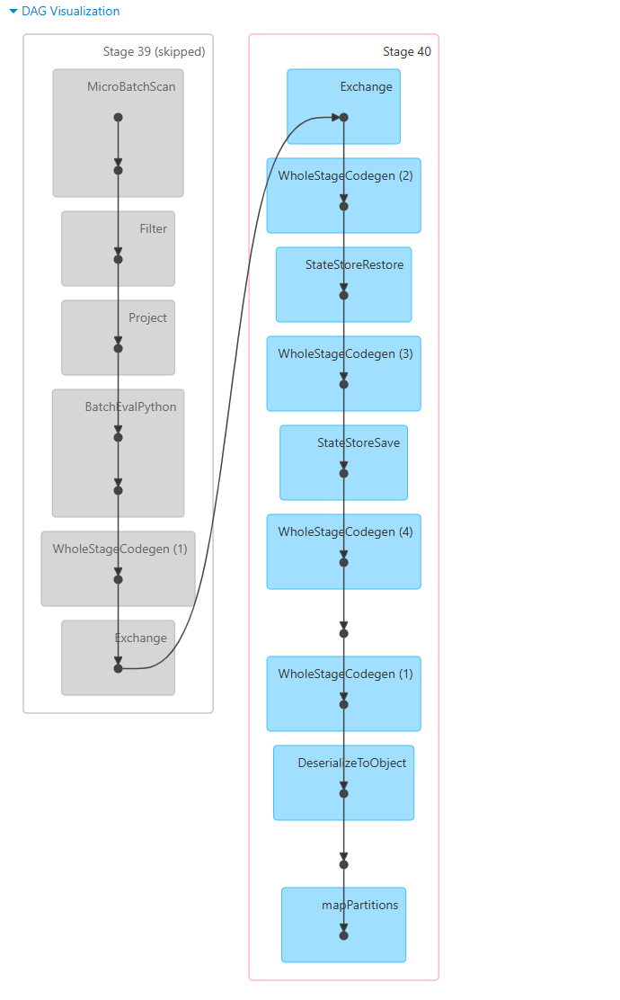
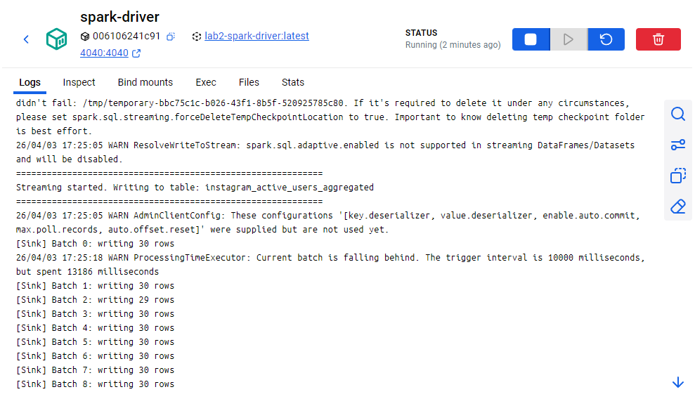
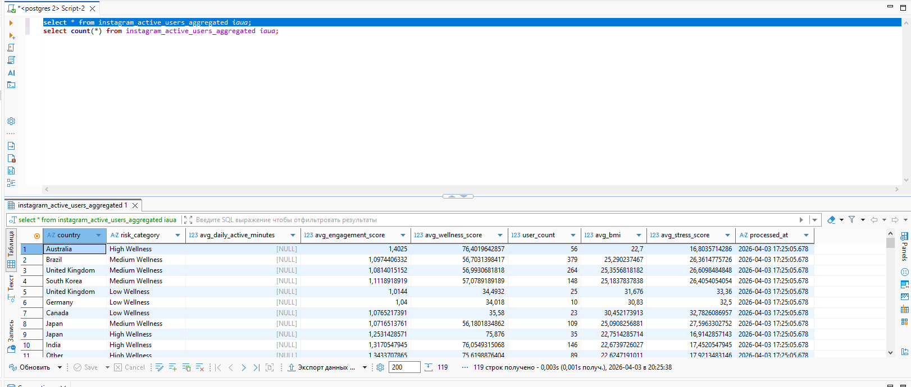
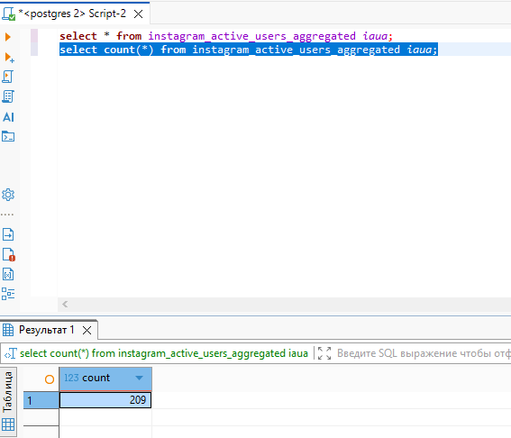

# Лабораторная работа №2
## Распределенная обработка данных в Apache Spark

---

### Содержание

1. [Архитектура и развертывание кластера Spark](#1-архитектура-и-развертывание-кластера-spark)
2. [Развертывание и конфигурация Kafka](#2-развертывание-и-конфигурация-kafka)
3. [Описание датасета](#3-описание-датасета)
4. [Продюсер: реализация и Dockerfile](#4-продюсер-реализация-и-dockerfile)
5. [Spark Driver: отдельный контейнер и submit задачи](#5-spark-driver-отдельный-контейнер-и-submit-задачи)
6. [Пайплайн обработки данных](#6-пайплайн-обработки-данных)
7. [Результаты выполнения](#7-результаты-выполнения)

---

## 1. Архитектура и развертывание кластера Spark

Кластер Apache Spark развернут с помощью Docker Compose и состоит из следующих компонентов:

### 1.1. Spark Master

Главный узел кластера запускается на основе образа `apache/spark-py:latest` и отвечает за координацию рабочих узлов и распределение задач:

```yaml
spark-master:
  image: apache/spark-py:latest
  container_name: spark-master
  command: /opt/spark/bin/spark-class org.apache.spark.deploy.master.Master
  ports:
    - "8080:8080"  # Web UI
    - "7077:7077"  # Port for workers connection
```

Master-узел предоставляет веб-интерфейс на порту 8080 для мониторинга состояния кластера и принимает подключения от worker-узлов на порту 7077.



### 1.2. Spark Workers (2 узла)

Для worker-узлов создан отдельный `Dockerfile.worker`, который обеспечивает корректную работу с правами доступа и создает рабочую директорию:

```dockerfile
FROM apache/spark-py:latest

USER root

RUN mkdir -p /opt/spark/work && chown -R 185:0 /opt/spark/work

USER 185
```

Оба worker-узла подключаются к мастеру через внутренний URL `spark://spark-master:7077`:

```yaml
spark-1:
  build:
    dockerfile: Dockerfile.worker
  command: /opt/spark/bin/spark-class org.apache.spark.deploy.worker.Worker spark://spark-master:7077
  depends_on:
    - spark-master

spark-2:
  build:
    dockerfile: Dockerfile.worker
  command: /opt/spark/bin/spark-class org.apache.spark.deploy.worker.Worker spark://spark-master:7077
  depends_on:
    - spark-master
```

Использование двух worker-узлов позволяет реализовать параллельную обработку данных и демонстрирует распределенные вычисления в рамках лабораторной работы.

---

## 2. Развертывание и конфигурация Kafka

В качестве брокера сообщений используется Apache Kafka в режиме KRaft (без ZooKeeper):

```yaml
broker:
  image: apache/kafka:latest
  container_name: broker
  environment:
    KAFKA_NODE_ID: 1
    KAFKA_PROCESS_ROLES: broker,controller
    KAFKA_LISTENERS: PLAINTEXT://0.0.0.0:9092,CONTROLLER://0.0.0.0:9093
    KAFKA_ADVERTISED_LISTENERS: PLAINTEXT://broker:9092
    KAFKA_CONTROLLER_LISTENER_NAMES: CONTROLLER
    KAFKA_LISTENER_SECURITY_PROTOCOL_MAP: CONTROLLER:PLAINTEXT,PLAINTEXT:PLAINTEXT
    KAFKA_CONTROLLER_QUORUM_VOTERS: 1@broker:9093
    KAFKA_OFFSETS_TOPIC_REPLICATION_FACTOR: 1
    KAFKA_TRANSACTION_STATE_LOG_REPLICATION_FACTOR: 1
    KAFKA_TRANSACTION_STATE_LOG_MIN_ISR: 1
    KAFKA_GROUP_INITIAL_REBALANCE_DELAY_MS: 0
    KAFKA_NUM_PARTITIONS: 3
    KAFKA_LOG_DIRS: /var/lib/kafka/data
```

### Ключевые параметры конфигурации:

| Параметр | Значение | Описание |
|----------|----------|----------|
| `KAFKA_PROCESS_ROLES` | `broker,controller` | Узел выполняет обе роли — брокера и контроллера (KRaft mode) |
| `KAFKA_NUM_PARTITIONS` | `3` | Количество партиций для новых топиков |
| `KAFKA_LISTENERS` | `PLAINTEXT://0.0.0.0:9092` | Слушает входящие подключения на всех интерфейсах |
| `KAFKA_ADVERTISED_LISTENERS` | `PLAINTEXT://broker:9092` | Адрес для клиентов внутри Docker-сети |
| `KAFKA_OFFSETS_TOPIC_REPLICATION_FACTOR` | `1` | Фактор репликации для топика смещений (один узел) |

Данные Kafka сохраняются в именованном томе `kafka-data`, что обеспечивает сохранность сообщений при перезапуске контейнера.

Для брокера настроен healthcheck, проверяющий доступность списка топиков перед запуском зависимых сервисов:

```yaml
healthcheck:
  test: ["CMD", "opt/kafka/bin/kafka-topics.sh", "--bootstrap-server", "localhost:9092", "--list"]
  interval: 5s
  timeout: 3s
  retries: 5
```

---

## 3. Описание датасета

### 3.1. Источник данных

В качестве источника данных используется датасет **Instagram Users Lifestyle & Health** с платформы Kaggle. Датасет содержит информацию о пользователях Instagram, их поведении на платформе, образе жизни и показателях здоровья.

### 3.2. Структура данных

Датасет содержит **53 поля** на одного пользователя, которые можно разделить на несколько категорий:

#### Демографические данные:
- `user_id` — уникальный идентификатор пользователя
- `age` — возраст
- `gender` — пол
- `country` — страна проживания
- `urban_rural` — городское/сельское проживание
- `income_level` — уровень дохода
- `employment_status` — статус занятости
- `education_level` — уровень образования
- `relationship_status` — семейное положение
- `has_children` — наличие детей

#### Показатели здоровья:
- `body_mass_index` — индекс массы тела (BMI)
- `blood_pressure_systolic` / `blood_pressure_diastolic` — артериальное давление
- `exercise_hours_per_week` — часы физических упражнений в неделю
- `sleep_hours_per_night` — часов сна за ночь
- `diet_quality` — качество питания
- `smoking` — курение
- `alcohol_frequency` — частота употребления алкоголя
- `perceived_stress_score` — уровень воспринимаемого стресса (0–40)
- `self_reported_happiness` — самооценка счастья

#### Активность в Instagram:
- `daily_active_minutes_instagram` — минут активности в день
- `sessions_per_day` — сессий в день
- `posts_created_per_week` — публикаций в неделю
- `reels_watched_per_day` — просмотренных Reels в день
- `stories_viewed_per_day` — просмотренных Stories в день
- `likes_given_per_day` — лайков в день
- `comments_written_per_day` — комментариев в день
- `dms_sent_per_week` / `dms_received_per_week` — личных сообщений в неделю
- `followers_count` / `following_count` — подписчики/подписки

#### Вовлеченность и поведение:
- `user_engagement_score` — интегральный показатель вовлеченности
- `ads_clicked_per_day` — кликов по рекламе в день
- `time_on_feed_per_day` — время в ленте
- `time_on_reels_per_day` — время в Reels
- `content_type_preference` — предпочитаемый тип контента

#### Безопасность и аккаунт:
- `privacy_setting_level` — уровень приватности
- `two_factor_auth_enabled` — включена ли двухфакторная аутентификация
- `biometric_login_used` — использование биометрического входа
- `subscription_status` — статус подписки

---

## 4. Продюсер: реализация и Dockerfile

### 4.1. Dockerfile

Продюсер упакован в отдельный Docker-контейнер:

```dockerfile
FROM python:3.11-slim

WORKDIR /app

COPY producer/requirements.txt .
RUN pip install --no-cache-dir -r requirements.txt

COPY producer/producer.py .

CMD ["python", "-u", "producer.py"]
```

Используется минимальный образ `python:3.11-slim` для сокращения размера контейнера. Флаг `-u` в команде запуска обеспечивает unbuffered вывод логов.

### 4.2. Принцип работы

Продюсер читает CSV-файл `instagram_usage_lifestyle.csv` с помощью `pandas` и преобразует его в список JSON-записей. Затем данные отправляются в Kafka топик `instagram-users` батчами:

```python
# Основные параметры из переменных окружения
KAFKA_SERVERS = 'broker:9092'
KAFKA_TOPIC = 'instagram-users'
BATCH_SIZE = 2000       # записей за одну отправку
DELAY_SECONDS = 5       # задержка между батчами
```

**Циклическая отправка:** после завершения всех записей датасета продюсер начинает цикл заново, что обеспечивает непрерывный поток данных для стримингового потребления:

```python
while True:
    cycle_count += 1
    for i in range(0, len(records), BATCH_SIZE):
        batch = records[i:i+BATCH_SIZE]
        for record in batch:
            producer.send(KAFKA_TOPIC, value=record)
        producer.flush()
        time.sleep(DELAY_SECONDS)
```

### 4.3. Конфигурация KafkaProducer

```python
producer = KafkaProducer(
    bootstrap_servers=KAFKA_SERVERS.split(','),
    value_serializer=lambda v: json.dumps(v).encode('utf-8'),
    max_request_size=10485760,  # 10 MB — большой размер сообщения
    linger_ms=10,               # ожидание 10ms для батчинга
)
```

Продюсер подключается к Kafka только после подтверждения здоровья брокера (`depends_on: broker: condition: service_healthy`). CSV-файл монтируется через Docker volume для возможности быстрой замены данных без пересборки образа.



---

## 5. Spark Driver: отдельный контейнер и submit задачи

### 5.1. Зачем нужен отдельный контейнер

Spark Driver выделен в отдельный контейнер по следующим причинам:

1. **Изоляция зависимостей** — драйвер требует дополнительные Python-библиотеки (`pyspark`, `kafka-python`, `psycopg2` и др.), которые не нужны на worker-узлах
2. **Отдельная точка входа** — драйвер запускает `spark-submit` и управляет жизненным циклом приложения
3. **Сетевая конфигурация** — драйвер имеет собственные порты (4040 для Spark UI) и требует правильной маршрутизации для связи с executor'ами
4. **Порядок запуска** — драйвер должен стартовать после всех компонентов кластера (master, workers, Kafka, Postgres)

### 5.2. Dockerfile.driver

```dockerfile
FROM apache/spark-py:latest

USER root
WORKDIR /app

COPY consumer/requirements.txt .
RUN pip install --no-cache-dir -r requirements.txt

COPY consumer/consumer.py .

COPY submit.sh .
RUN chmod +x submit.sh

CMD ["./submit.sh"]
```

Образ наследуется от `apache/spark-py:latest`, устанавливаются Python-зависимости из `consumer/requirements.txt` и копируется скрипт пайплайна.

### 5.3. Submit скрипт

Задача отправляется на кластер через `submit.sh`:

```bash
#!/bin/bash
set -e

# Ожидание готовности кластера
sleep 30

spark-submit \
  --packages org.apache.spark:spark-sql-kafka-0-10_2.12:3.5.0,org.postgresql:postgresql:42.7.3 \
  --master spark://spark-master:7077 \
  --deploy-mode client \
  --conf spark.driver.host=spark-driver \
  --conf spark.driver.bindAddress=0.0.0.0 \
  --name InstagramKafkaConsumer \
  /app/consumer.py
```

#### Параметры spark-submit:

| Параметр | Значение | Описание |
|----------|----------|----------|
| `--packages` | `spark-sql-kafka-0-10`, `postgresql` | Подключение коннекторов к Kafka и Postgres |
| `--master` | `spark://spark-master:7077` | Адрес мастера кластера |
| `--deploy-mode` | `client` | Драйвер работает внутри текущего контейнера |
| `spark.driver.host` | `spark-driver` | Имя хоста драйвера для executor'ов |
| `spark.driver.bindAddress` | `0.0.0.0` | Привязка к сетевым интерфейсам контейнера |
| `--name` | `InstagramKafkaConsumer` | Имя приложения в Spark UI |

Задержка `sleep 30` необходима для ожидания полного запуска master, workers, Kafka и Postgres перед отправкой задачи.

### 5.4. Переменные окружения

Контейнер драйвера получает конфигурацию через переменные окружения:

```yaml
environment:
  KAFKA_BOOTSTRAP_SERVERS: broker:9092
  KAFKA_TOPIC: instagram-users
  POSTGRES_HOST: postgres
  POSTGRES_PORT: 5432
  POSTGRES_USER: postgres
  POSTGRES_PASSWORD: postgres
  POSTGRES_DB: postgres
  POSTGRES_TABLE: instagram_users
```



---

## 6. Пайплайн обработки данных

### 6.1. Общая архитектура

Пайплайн представляет собой **стриминговое приложение** Spark Structured Streaming, которое:

1. **Читает** сообщения из Kafka топика
2. **Парсит** JSON в структурированные данные
3. **Фильтрует** пользователей по уровню стресса
4. **Применяет** UDF для расчета wellness score
5. **Агрегирует** данные по стране и категории риска
6. **Записывает** результат в Postgres

```
Kafka → Parse → Filter → UDF(Wellness) → Aggregate → Postgres
```

### 6.2. Чтение из Kafka

```python
df = spark.readStream \
    .format("kafka") \
    .option("kafka.bootstrap.servers", "broker:9092") \
    .option("subscribe", "instagram-users") \
    .option("startingOffsets", "earliest") \
    .option("failOnDataLoss", "false") \
    .load()
```

Spark подключается к Kafka как стриминговый источник, начиная с самых ранних доступных смещений. Параметр `failOnDataLoss=false` предотвращает падение при потере данных.

### 6.3. Парсинг сообщений

```python
df = df.select(from_json(col("value").cast("string"), schema).alias("data")) \
       .select("data.*") \
       .withColumn("processed_at", current_timestamp())
```

Каждое сообщение десериализуется из JSON согласно строгой схеме из 53 полей и дополняется меткой времени обработки.

### 6.4. Фильтрация и UDF Wellness Score

**Фильтрация:** отбираются только пользователи с уровнем воспринимаемого стресса выше 10 баллов:

```python
filtered = df.filter(col("perceived_stress_score") > 10)
```

**UDF функция `calculate_wellness`:** рассчитывает интегральный показатель благополучия на основе трёх метрик:

```python
def calculate_wellness(bmi, stress, sleep):
    bmi_score = max(0, 10 - abs(bmi - 22))           # оптимум BMI ~22
    stress_score = max(0, 10 - stress / 4)           # меньше стресс = лучше
    sleep_score = max(0, 10 - abs(sleep - 7.5) * 2)  # оптимум сна ~7.5ч
    
    wellness = (bmi_score + stress_score + sleep_score) / 3 * 10
    wellness = round(min(100, max(0, wellness)), 2)
    
    if wellness >= 70: category = "High Wellness"
    elif wellness >= 40: category = "Medium Wellness"
    else: category = "Low Wellness"
    
    return wellness, category
```

UDF возвращает составной тип с двумя полями:
- `wellness_score` — числовой показатель от 0 до 100
- `risk_category` — категория риска (High / Medium / Low Wellness)

Интеграция UDF в пайплайн:

```python
with_wellness = filtered.withColumn(
    "wellness_data",
    wellness_udf(col("body_mass_index"), col("perceived_stress_score"), col("sleep_hours_per_night"))
).select(
    "*",
    col("wellness_data.wellness_score").alias("wellness_score"),
    col("wellness_data.risk_category").alias("risk_category")
)
```

### 6.5. Агрегация

Данные агрегируются по **стране** и **категории риска** с вычислением средних показателей:

```python
df.groupBy("country", "risk_category").agg(
    avg("daily_active_minutes_instagram").alias("avg_daily_active_minutes"),
    avg("user_engagement_score").alias("avg_engagement_score"),
    avg("wellness_score").alias("avg_wellness_score"),
    count("user_id").alias("user_count"),
    avg("body_mass_index").alias("avg_bmi"),
    avg("perceived_stress_score").alias("avg_stress_score")
)
```

#### Результат агрегации:

| Поле | Описание |
|------|----------|
| `country` | Страна проживания |
| `risk_category` | Категория wellness (High/Medium/Low) |
| `avg_daily_active_minutes` | Среднее время в Instagram (мин/день) |
| `avg_engagement_score` | Средняя вовлеченность |
| `avg_wellness_score` | Средний показатель благополучия |
| `user_count` | Количество пользователей в группе |
| `avg_bmi` | Средний BMI |
| `avg_stress_score` | Средний уровень стресса |
| `processed_at` | Время обработки |

### 6.6. Запись в Postgres

Результаты записываются в таблицу `instagram_users` в Postgres с использованием `foreachBatch`:

```python
df_stream.writeStream \
    .foreachBatch(write_batch) \
    .outputMode("update") \
    .trigger(processingTime="10 seconds") \
    .queryName("AggregationSink") \
    .start()
```

Каждые **10 секунд** Spark проверяет наличие новых данных и выполняет батчевую запись. Режим `update` означает, что записываются только изменённые строки агрегации.

### 6.7. DAG выполнения и причина появления двух jobs

DAG (Directed Acyclic Graph) пайплайна визуализирует последовательность операций и показывает, как Spark разбивает вычисления на стадии (stages) для распределенного выполнения.





#### 6.7.1. Почему запускается **два job'а** вместо одного

Ключевая причина двух запусков кроется в реализации `foreachBatch`:

```python
def write_batch(batch_df, batch_id):
    cnt = batch_df.count()        # ← ACTION 1 → запускает JOB 1 (полный пайплайн)
    if cnt > 0:
        batch_df.write.jdbc(...)   # ← ACTION 2 → запускает JOB 2 (write через JDBC)
```

Каждый **action** в Spark (`count()`, `write.jdbc()`, `collect()` и т.д.) запускает отдельный **job**. В твоем пайплайне таких actions **два**, поэтому Spark выполняет **два job'а** с небольшой задержкой (~2 секунды):

| Job | Action | Что происходит | Почему второй Stage 0 skipped |
|-----|--------|----------------|-------------------------------|
| **Job 1** | `batch_df.count()` | Spark **материализует** весь streaming DataFrame: читает Kafka → фильтрует → применяет UDF → агрегирует → считает строки. Это **полный проход** по пайплайну. | — |
| **Job 2** | `batch_df.write.jdbc(...)` | Spark **снова проходит** по тому же DataFrame для записи в Postgres. Но Stage 0 (чтение Kafka) **пропускается** (skipped), потому что за ~2 секунды между Job 1 и Job 2 Kafka **не успела доставить новые сообщения** — смещения (offsets) не изменились, данных для повторного чтения нет. | Spark оптимизирует: если offset не изменился, `MicroBatchScan` не выполняется заново. Вместо этого используется состояние из предыдущего батча (checkpoint/state store). |

**Резюме:** два job'а появляются из-за того, что `count()` и `write.jdbc()` — это **два разных action'а**. Первый job показывает **полный DAG** (DAG_1), второй — **сокращённый DAG** с пропущенным Stage 0 (DAG_2).

> Если убрать `count()` и писать напрямую, останется **один job** на каждый триггер.

#### 6.7.2. Почему DAG разделяется на stages

Spark разбивает план выполнения на **stages** на основе **shuffle boundaries** — операций, требующих перераспределения данных между executor'ами. Ключевые правила:

- **Narrow зависимости** (`map`, `filter`, `select`, `withColumn`) — данные обрабатываются без перемещения между партициями, операции объединяются в один stage через **pipeline**
- **Wide зависимости** (`groupBy`, `join`, `distinct`) — требуют **shuffle**, т.е. перераспределения данных по ключам между узлами кластера, что создаёт границу между stages

#### 6.7.3. Анализ DAG_1 (Job 1 — полный пайплайн, инициирован `.count()`)

Первый DAG показывает **полный** пайплайн с тремя stages:

| Stage | Операция | Тип зависимости | Логическое действие | Где в коде |
|-------|----------|-----------------|---------------------|------------|
| **Stage 1** | `KafkaSource` → `Filter` → `UDF` → `Project` | Narrow | Чтение сообщений из Kafka, десериализация JSON по схеме, фильтрация `perceived_stress_score > 10`, вычисление `wellness_udf` | `read_from_kafka()` → `parse_messages()` → `filter_and_enrich()` |
| **Stage 2** | `Aggregate` (HashAggregate) | Wide (shuffle) | Группировка по `(country, risk_category)` с вычислением `avg()`, `count()` — данные перераспределяются по ключам между executor'ами | `aggregate_data()` — `df.groupBy("country", "risk_category").agg(...)` |
| **Stage 3** | `ForeachBatchSink` / `JDBC` | Narrow | Запись агрегированных результатов в Postgres через JDBC в режиме `append` | `write_to_postgres()` — `batch_df.write.jdbc(... mode="append")` |

**Детальный разбор Stage 1:**

```
KafkaSource[offsets: ...]
    ↓  (readStream, narrow)
DeserializeJSON (from_json + cast)
    ↓  (select "data.*", narrow)
Filter (perceived_stress_score > 10)
    ↓  (withColumn wellness_udf, narrow)
Project (extract wellness_score, risk_category)
```

Все операции внутри Stage 1 **pipeline'ятся** — Spark выполняет их за один проход по данным без промежуточной материализации. Это означает, что каждая запись из Kafka проходит весь путь от чтения до обогащения UDF без записи в промежуточное хранилище.

**Детальный разбор Stage 2:**

```
Shuffle Write (HashAggregate by country, risk_category)
    ↓  (shuffle boundary — данные перераспределяются)
Shuffle Read → HashAggregate (final aggregation)
```

На этом stage происходит **shuffle exchange**: executor'ы группируют строки по комбинации `(country, risk_category)` и отправляют их нужному executor'у, который выполняет финальную агрегацию. Именно здесь начинается распределённое вычисление средних значений.

**Детальный разбор Stage 3:**

```
Dataframe (aggregated results)
    ↓  (foreachBatch, narrow)
JDBC Write to Postgres
```

Финальный stage — запись в Postgres через `foreachBatch`. Это narrow операция, так как каждая строка записывается независимо.

#### 6.7.4. Анализ DAG_2 (Job 2 — запись, инициирована `.write.jdbc()`, Stage 0 skipped)

Второй DAG показывает **сокращённый** план с двумя stages, где первый stage помечен как **skipped**:

| Stage | Операция | Статус | Логическое действие | Где в коде |
|-------|----------|--------|---------------------|------------|
| **Stage 39** (skipped) | `KafkaSource` → десериализация → `Filter` → `UDF` | **SKIPPED** | Чтение, парсинг, фильтрация, UDF — **пропущено**, т.к. за ~2 секунды между Job 1 и Job 2 Kafka не доставила новых сообщений | `read_from_kafka()` → `filter_and_enrich()` |
| **Stage 40** | `Aggregate` → `ForeachBatchSink` | **Выполняется** | Группировка + запись в Postgres через JDBC | `aggregate_data()` → `write_to_postgres()` |

**Почему Stage 39 пропущен (skipped):**

1. **Offset не изменился** — между `count()` (Job 1) и `write.jdbc()` (Job 2) прошло ~2 секунды. За это время продюсер не отправил новых сообщений в Kafka, поэтому смещения (offsets) остались прежними. Spark видит, что читать нечего, и пропускает Stage 0.
2. **State store reuse** — Structured Streaming хранит состояние (state store) между actions. Агрегированные данные из Job 1 уже доступны в state store, поэтому Job 2 переиспользует их без повторного чтения Kafka.
3. **Incremental processing** — при `outputMode("update")` Spark обрабатывает только **изменённые** строки. Если между Job 1 и Job 2 агрегация не изменилась, чтение из Kafka избыточно.

В Spark UI это отображается как серый (неактивный) Stage 39 с пометкой `(skipped)` и синий (активный) Stage 40, который выполняет только агрегацию и запись.

#### 6.7.5. Полный обход DAG: от узлов к коду

Ниже представлен последовательный обход каждого узла DAG с точным соответствием операции Spark и строкам кода. Каждый узел показан в порядке физического выполнения внутри stages.

---

**DAG_1 (Job 1) — полный пайплайн, инициирован `batch_df.count()`:**

**Stage 1: Чтение → Парсинг → Фильтрация → UDF**

```
MicroBatchScan[Kafka]
       ↓
     Filter
       ↓
    Project
       ↓
BatchEvalPython
       ↓
    Project
```

| Узел DAG | Что делает | Логическое действие | Где в коде |
|----------|-----------|---------------------|------------|
| `MicroBatchScan[Kafka]` | Читает батч сообщений из Kafka топика по смещениям | Стриминговое чтение: Spark запрашивает сообщения из топика `instagram-users` начиная с `earliest` offsets. Возвращает DataFrame с колонками `key`, `value`, `topic`, `partition`, `offset`, `timestamp` | `read_from_kafka()` — `spark.readStream.format("kafka")...load()` |
| `Filter` | Применяет предикат-условие к каждой строке | Отсеивает пользователей с `perceived_stress_score <= 10`. В остаются только записи, где уровень стресса выше порога. Это **narrow** операция — каждая строка обрабатывается независимо | `filter_and_enrich()` — `df.filter(col("perceived_stress_score") > 10)` |
| `Project` | Выбирает и переименовывает колонки | После чтения из Kafka значение находится в бинарном поле `value`. Этот узел выполняет `cast("string")` + `from_json(..., schema)` и затем разворачивает вложенную структуру `data.*` в плоские колонки. Также добавляет колонку `processed_at` через `current_timestamp()` | `parse_messages()` — `df.select(from_json(col("value").cast("string"), schema).alias("data")).select("data.*").withColumn("processed_at", current_timestamp())` |
| `BatchEvalPython` | Выполняет Python UDF для каждой строки | Вызывает `calculate_wellness(bmi, stress, sleep)` — для каждой записи вычисляется integral wellness score и risk_category. Результат записывается в составную колонку `wellness_data` типа `Struct(wellness_score, risk_category)`. Поскольку это Python UDF, Spark не может оптимизировать его в JVM и выполняет через Python worker | `filter_and_enrich()` — `wellness_udf(col("body_mass_index"), col("perceived_stress_score"), col("sleep_hours_per_night"))` |
| `Project` | Извлекает вложенные поля из struct | Разворачивает `wellness_data.wellness_score` → `wellness_score` и `wellness_data.risk_category` → `risk_category` как отдельные колонки верхнего уровня. Также сохраняет все предыдущие колонки (`"*"`). После этого каждая строка содержит 53 исходных поля + `wellness_score` + `risk_category` + `processed_at` | `filter_and_enrich()` — `.select("*", col("wellness_data.wellness_score").alias("wellness_score"), col("wellness_data.risk_category").alias("risk_category"))` |

---

**Stage 2: Shuffle + Агрегация**

```
Exchange (hashpartition by country, risk_category)
       ↓
HashAggregate (partial)
       ↓
HashAggregate (final)
```

| Узел DAG | Что делает | Логическое действие | Где в коде |
|----------|-----------|---------------------|------------|
| `Exchange (hashpartition)` | Перераспределяет строки по ключам | Все строки с одинаковой парой `(country, risk_category)` отправляются на один и тот же executor. Это **shuffle boundary** — граница между Stage 1 и Stage 2. Например, все записи `("Russia", "Low Wellness")` попадают на один partition, `("USA", "High Wellness")` — на другой | `aggregate_data()` — `df.groupBy("country", "risk_category")` — метод `groupBy()` неявно вызывает shuffle |
| `HashAggregate (partial)` | Промежуточная агрегация на каждой partition | На каждой partition executor вычисляет partial-агрегаты: частичные суммы и счётчики для `avg(daily_active_minutes_instagram)`, `avg(user_engagement_score)`, `count(user_id)` и т.д. Результаты — промежуточные строки с накопленными значениями | `aggregate_data()` — `.agg(avg(...), avg(...), count(...), ...)` — первая фаза агрегации до shuffle |
| `HashAggregate (final)` | Финальная агрегация | После shuffle Spark собирает partial-агрегаты и вычисляет итоговые значения. Добавляет колонку `processed_at` через `current_timestamp().cast("string")`. Результат — одна строка на каждую уникальную комбинацию `(country, risk_category)` | `aggregate_data()` — `.withColumn("processed_at", current_timestamp().cast("string"))` |

---

**Stage 3: Запись в Postgres**

```
WriteToMicroBatchOutput (ForeachBatch)
       ↓
  JDBC append
```

| Узел DAG | Что делает | Логическое действие | Где в коде |
|----------|-----------|---------------------|------------|
| `WriteToMicroBatchOutput` | Инициирует запись результата микробатча | Spark Streaming вызывает `foreachBatch(write_batch)` для каждого триггера (каждые 15 секунд). Это action-операция, которая запускает весь DAG — без неё выполнение не начнётся | `write_to_postgres()` — `df_stream.writeStream.foreachBatch(write_batch)...start()` |
| `JDBC append` | Записывает батч строк в Postgres | Каждая aggregated строка вставляется в таблицу `instagram_active_users_aggregated` через JDBC. Режим `append` означает, что новые данные добавляются к существующим. Подключение через `jdbc:postgresql://postgres:5432/postgres` с драйвером `org.postgresql.Driver` | `write_to_postgres()` → `write_batch()` — `batch_df.write.jdbc(url=jdbc_url, table=table_name, mode="append", properties=properties)` |

---

**DAG_2 (Job 2) — оптимизированный пайплайн, инициирован `batch_df.write.jdbc()`:**

```
Stage 39 (skipped): MicroBatchScan → Filter → Project → BatchEvalPython → Project → Exchange
       ↓ (данные переиспользуются из state store)
Stage 40: Exchange → HashAggregate → DeserializToObject → mapPartitions → JDBC write
```

Здесь Stage 39 (чтение→UDF) **пропущен**, потому что:

- **Offset не изменился** — за ~2 секунды между Job 1 и Job 2 Kafka не доставила новых сообщений
- **State store reuse** — агрегированные данные из Job 1 уже доступны, Spark переиспользует их
- **Incremental processing** — при `outputMode("update")` обрабатываются только изменённые строки

Это можно наблюдать в Spark UI по статусу stage: `SKIPPED` означает, что результат уже доступен из предыдущего выполнения или данных для обработки нет.

---

**Полная цепочка прохождения данных:**

```
Kafka (сообщения)
  → MicroBatchScan      [чтение батча по offset]
  → Filter              [стресс > 10]
  → Project             [JSON parse → flat columns + processed_at]
  → BatchEvalPython     [calculate_wellness UDF]
  → Project             [extract wellness_score, risk_category]
  ====== shuffle boundary (Stage 0 → Stage 1) ======
  → Exchange            [hash by (country, risk_category)]
  → HashAggregate       [partial + final avg(), count()]
  ====== shuffle boundary (Stage 1 → Stage 2) ======
  → WriteToMicroBatch   [foreachBatch trigger]
  → JDBC append         [INSERT INTO postgres table]
```

### 6.8. Consumer логика в Spark UI

Интерфейс Spark Streaming показывает активность потребителя и текущее состояние микробатчей:



---

## 7. Результаты выполнения

### 7.1. Данные в Postgres

Результаты агрегации доступны в таблице `instagram_users` базы данных Postgres. Просмотр через DBeaver:





### 7.2. Практическое применение

Полученные данные могут использоваться для:

- **Анализа аудитории** — понимание демографических характеристик пользователей с различным уровнем благополучия
- **Персонализации контента** — адаптация рекомендательных систем на основе wellness score
- **Выявления групп риска** — определение стран/регионов с преобладанием "Low Wellness" для целевых интервенций
- **Исследования корреляций** — изучение взаимосвязи между активностью в Instagram и показателями здоровья
- **Бизнес-аналитики** — оптимизация рекламных кампаний с учётом психографического профиля аудитории

### 7.3. Запуск проекта

Для развертывания всех компонентов используется скрипт `submit.sh` или прямая команда:

```bash
docker compose up --build
```

Порядок запуска компонентов обеспечивается зависимостями в `docker-compose.yaml`:
1. Kafka Broker (с healthcheck)
2. Spark Master → Workers
3. Postgres
4. Producer (после Kafka)
5. Spark Driver (после всех компонентов)
