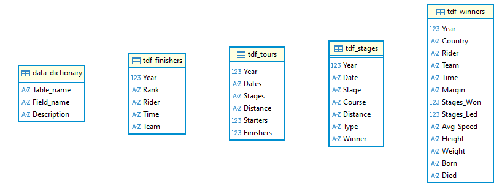
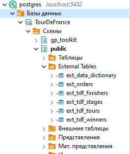
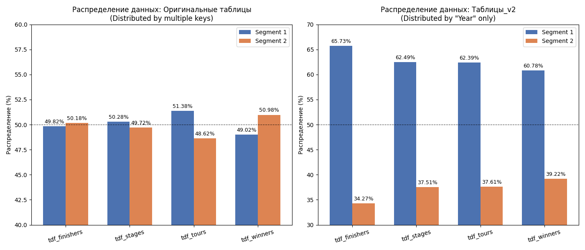
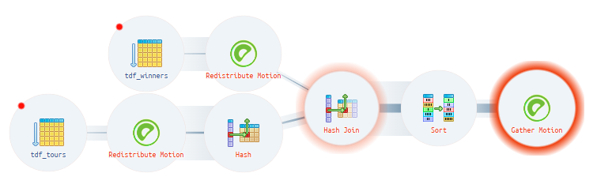
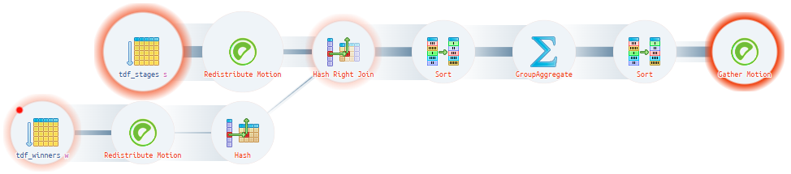
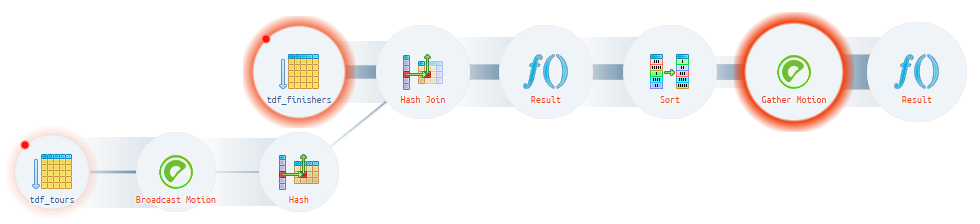
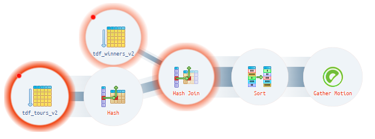
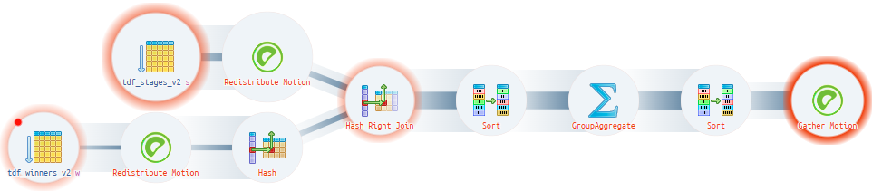
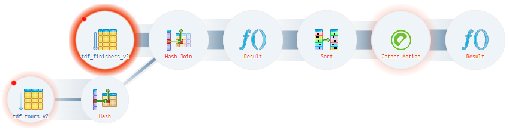
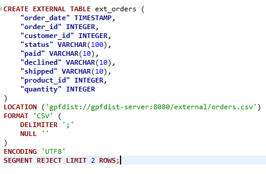

# Лабораторная работа №3
## MPP-база данных GreenPlum: распределение данных и оптимизация запросов

---

## Содержание

1. [Введение](#1-введение)
2. [Развёртывание инфраструктуры](#2-развёртывание-инфраструктуры)
3. [Описание датасета](#3-описание-датасета)
4. [Загрузка данных через PXF](#4-загрузка-данных-через-pxf)
5. [Анализ распределения данных](#5-анализ-распределения-данных)
6. [Оптимизация запросов и анализ Motion](#6-оптимизация-запросов-и-анализ-motion)
7. [Реализация GPFDIST](#7-реализация-gpfdist)
8. [Заключение](#8-заключение)

---

## 1. Введение

Цель данной лабораторной работы — получить практический опыт работы с GreenPlum, массово-параллельной (MPP) системой управления базами данных. Работа охватывает развёртывание кластера, загрузку данных из внешних источников, выбор ключей дистрибьюции, анализ перекоса данных и оптимизацию запросов через модификацию стратегии распределения.

---

## 2. Развёртывание инфраструктуры

### 2.1 Архитектура

С помощью Docker Compose был развёрнут GreenPlum кластер со следующей конфигурацией:

- **1 мастер-нода** (`master`): координирует выполнение запросов и управляет метаданными
- **2 сегмент-ноды** (`segment1`, `segment2`): хранят и обрабатывают данные параллельно
- **Зеркальные сегменты (Mirror)**: каждый первичный сегмент имеет зеркальную копию для отказоустойчивости (настроено через команду `/start_gpdb.sh "00:primary" "01:mirror"`)
- **Внешнее хранилище**: Microsoft SQL Server для исходных данных
- **GPFDIST-сервер**: высокопроизводительный файловый загрузчик для GreenPlum

### 2.2 Конфигурация Docker Compose

```yaml
services:
  mssql:
    image: mcr.microsoft.com/mssql/server:2022-latest
    ports: ["1433:1433"]
    
  master:
    image: woblerr/greenplum:6.27.1-v0.6
    ports: ["5432:5432"]
    volumes:
      - ./pxf_conf/lib:/data/pxf/lib
      - ./pxf_conf/servers/mssql:/data/pxf/servers/mssql
      
  segment1, segment2:
    command: /start_gpdb.sh "00:primary" "01:mirror"
```

### 2.3 Настройка PXF

PXF (Pivotal Extension Framework) был настроен путём монтирования:
- **JDBC-драйвер**: `./pxf_conf/lib` → `/data/pxf/lib`
- **Профиль сервера**: `./pxf_conf/servers/mssql` → `/data/pxf/servers/mssql`

---

## 3. Описание датасета

### 3.1 Выбор датасета

**Датасет**: TourDeFrance  
**Источник**: Maven Analytics Data Playground  
**Тег**: Multiple Table

### 3.2 Обзор датасета

Датасет TourDeFrance содержит исторические данные о велогонке Тур де Франс:

| Таблица | Описание | Колонки |
|---------|----------|---------|
| **tdf_tours** | Общая статистика по турам | Year, Dates, Stages, Distance, Starters, Finishers |
| **tdf_winners** | Победители тура с биографическими данными | Year, Country, Rider, Team, Time, Margin, Stages_Won, Stages_Led, Avg_Speed, Height, Weight, Born, Died |
| **tdf_stages** | Результаты отдельных этапов | Year, Date, Stage, Course, Distance, Type, Winner |
| **tdf_finishers** | Топ финишировавших | Year, Rank, Rider, Time, Team |
| **data_dictionary** | Метаданные полей | Table_name, Field_name, Description |

### 3.3 ER-диаграмма

ER-диаграмма датасета TourDeFrance:



Связи между таблицами:

- **tdf_tours** ↔ **tdf_winners**: связь один-к-одному по `Year`
- **tdf_winners** ↔ **tdf_stages**: связь один-ко-многим через `Winner` = `Rider`
- **tdf_tours** ↔ **tdf_finishers**: связь один-ко-многим по `Year`

### 3.4 Процесс загрузки данных

1. Данные были скачаны из Maven Analytics в формате CSV
2. Импортированы в MSSQL через DBeaver с использованием импорта из CSV
3. Созданы внешние таблицы в GreenPlum для доступа к данным MSSQL через PXF

---

## 4. Загрузка данных через PXF

### 4.1 Создание внешних таблиц

Внешние таблицы были созданы для доступа к данным из MSSQL через PXF:



```sql
CREATE EXTERNAL TABLE ext_tdf_finishers (
  "Year" int,
  "Rank" varchar(10),
  "Rider" varchar(50),
  "Time" varchar(50),
  "Team" varchar(50)
)
LOCATION ('pxf://tdf_finishers?PROFILE=JDBC&SERVER=mssql')
FORMAT 'CUSTOM' (FORMATTER='pxfwritable_import');
```

Аналогичные таблицы были созданы для `tdf_stages`, `tdf_tours`, `tdf_winners` и `data_dictionary`.

### 4.2 Обоснование выбора ключей дистрибьюции

При начальном создании таблиц (v1) ключи дистрибьюции выбирались на основе:
1. **Анализа количества уникальных значений** — выполнялись запросы для определения кардинальности каждой колонки
2. **Логических предположений** — с учётом паттернов запросов и условий соединений
3. **Композитных ключей** — использование нескольких колонок для лучшего распределения

**Начальные ключи дистрибьюции (v1)**:
| Таблица | Ключ дистрибьюции |
|---------|-------------------|
| tdf_finishers | (`Year`, `Team`) |
| tdf_stages | (`Year`, `Type`) |
| tdf_tours | (`Year`, `Stages`) |
| tdf_winners | (`Year`, `Country`, `Team`) |

---

## 5. Анализ распределения данных

### 5.1 Начальное распределение (таблицы v1)

Начальное распределение с композитными ключами дало практически **равное разделение 50/50** между сегментами **без перекоса данных**. Это было проверено с помощью запроса:

```sql
SELECT gp_segment_id, COUNT(*), 
       ROUND(100.0 * COUNT(*) / SUM(COUNT(*)) OVER (), 2) as percent
FROM tdf_finishers
GROUP BY gp_segment_id;
```

### 5.2 Модифицированное распределение (таблицы v2)

Для оптимизации производительности запросов и устранения Motion-операций таблицы были пересозданы с ключами дистрибьюции по одной колонке:

**Модифицированные ключи дистрибьюции (v2)**:
| Таблица | Ключ дистрибьюции |
|---------|-------------------|
| tdf_finishers_v2 | (`Year`) |
| tdf_stages_v2 | (`Year`) |
| tdf_tours_v2 | (`Year`) |
| tdf_winners_v2 | (`Year`) |

### 5.3 Анализ перекоса данных

После изменения распределения на одну колонку `Year` появился некоторый перекос данных (см. `seg_dist.png`). Это ожидаемо, потому что:
- Годы — это дискретные значения
- Хеш-распределение годов может быть неравномерным между сегментами
- Некоторые годы могут иметь больше связанных записей, чем другие



---

## 6. Оптимизация запросов и анализ Motion

### 6.1 Стратегия проектирования запросов

Были разработаны три запроса для демонстрации различных паттернов выполнения:
1. **Запрос 1**: ожидается хорошее выполнение без Motion-операций (соединение по ключу дистрибьюции `Year`)
2. **Запрос 2**: ожидается Redistribution Motion (соединение по колонке `Rider`, не являющейся ключом дистрибьюции)
3. **Запрос 3**: ожидается Broadcast Motion (фильтрация по нескольким годам с композитными ключами дистрибьюции)

### 6.2 Анализ результатов запросов (таблицы v1 с композитными ключами)

#### Запрос 1: Сравнение общей статистики туров с победителями

**Описание запроса**: Запрос соединяет таблицы `tdf_tours` и `tdf_winners` по колонке `Year`, фильтруя данные с 2000 года. Предполагалось, что соединение по `Year` будет выполняться без Motion-операций, так как `Year` входит в ключи дистрибьюции обеих таблиц.

```sql
SELECT t."Year", t."Starters", t."Finishers",
       w."Rider" as winner_name, w."Country", w."Stages_Won"
FROM tdf_tours t
JOIN tdf_winners w ON t."Year" = w."Year"
WHERE t."Year" >= 2000;
```

**Фактический результат**: Появился **Redistribution Motion**



**Объяснение**: Несмотря на то, что `Year` входит в композитные ключи дистрибьюции обеих таблиц (`tdf_tours` распределена по `Year, Stages`, `tdf_winners` — по `Year, Country, Team`), GreenPlum хеширует **все** колонки ключа дистрибьюции. Даже при одинаковом `Year`, строки с разными значениями вторых колонок (`Stages` vs `Country, Team`) получают различные хеш-значения и оказываются на разных сегментах. Для выполнения соединения требуется перераспределение данных.

---

#### Запрос 2: Поиск гонщиков, выигравших тур и этапы

**Описание запроса**: Запрос находит победителей тура, которые также выигрывали отдельные этапы. Соединение происходит по колонкам `Rider` (из `tdf_winners`) и `Winner` (из `tdf_stages`). Ожидалось появление Redistribution Motion, так как соединение выполняется не по ключу дистрибьюции.

```sql
SELECT w."Year", w."Rider" as tour_winner, w."Country",
       COUNT(DISTINCT s."Stage") as stages_won_count,
       STRING_AGG(DISTINCT s."Type", ', ') as stage_types
FROM tdf_winners w
LEFT JOIN tdf_stages s ON w."Rider" = s."Winner"
WHERE w."Year" >= 2010
GROUP BY w."Year", w."Rider", w."Country";
```

**Фактический результат**: Появился **Redistribution Motion**



**Объяснение**: Ключи дистрибьюции таблиц — `Year` (в составе композитных ключей), но соединение выполняется по `Rider` = `Winner`. GreenPlum должен перераспределить данные между сегментами, чтобы строки с одинаковыми гонщиками оказались на одном сегменте для выполнения GROUP BY и агрегации.

---

#### Запрос 3: Статистика финишировавших с информацией о туре

**Описание запроса**: Запрос соединяет `tdf_finishers` и `tdf_tours` по `Year` с фильтрацией по трём конкретным годам (2015, 2016, 2017). Предполагалось появление Broadcast Motion из-за малого размера выборки и композитных ключей дистрибьюции.

```sql
SELECT f."Year", f."Rider", f."Team", f."Rank",
       t."Starters", t."Finishers", t."Distance",
       ROUND(100.0 * t."Finishers" / NULLIF(t."Starters", 0), 2) as completion_rate
FROM tdf_finishers f
JOIN tdf_tours t ON f."Year" = t."Year"
WHERE f."Year" IN (2015, 2016, 2017)
  AND CAST(f."Rank" AS INTEGER) <= 10;
```

**Фактический результат**: Появился **Broadcast Motion**



**Объяснение**: Комбинация композитных ключей дистрибьюции (`Year, Team` для `tdf_finishers` и `Year, Stages` для `tdf_tours`) и фильтрации по трём годам привела к тому, что оптимизатор выбрал трансляцию меньшей таблицы на все сегменты. При композитных ключах строки с одинаковым `Year`, но разными `Team`/`Stages` могут находиться на разных сегментах, что делает локальное соединение невозможным.

---

### 6.3 Решение: таблицы v2 с одноколоночными ключами дистрибьюции

Для устранения Motion-операций таблицы были пересозданы с ключами дистрибьюции только по колонке `Year`:

```sql
-- Таблицы v2 с распределением по Year
CREATE TABLE tdf_finishers_v2 AS SELECT * FROM ext_tdf_finishers
DISTRIBUTED BY ("Year");

CREATE TABLE tdf_stages_v2 AS SELECT * FROM ext_tdf_stages
DISTRIBUTED BY ("Year");

CREATE TABLE tdf_tours_v2 AS SELECT * FROM ext_tdf_tours
DISTRIBUTED BY ("Year");

CREATE TABLE tdf_winners_v2 AS SELECT * FROM ext_tdf_winners
DISTRIBUTED BY ("Year");
```

**Обоснование**: Все запросы используют `Year` в условиях соединения и фильтрации. Распределение по этой колонке обеспечит локализацию данных на сегментах и устранит необходимость в Motion-операциях.

---

### 6.4 Результаты после оптимизации (таблицы v2)

После изменения ключей дистрибьюции на одноколоночные (только `Year`) получены следующие результаты:

**Запрос 1 v2** — соединение по `Year` выполняется локально на каждом сегменте, Motion-операции устранены:



**Запрос 2 v2** — **ухудшение производительности**: Redistribution Motion остался, но теперь выполняется дольше из-за перекоса данных:



**Объяснение**: Ключ соединения `Rider` не участвует в распределении данных. При распределении только по `Year` данные перекосились между сегментами (неравномерное распределение записей по годам). В результате Redistribution Motion требует больше времени, так как один сегмент обрабатывает значительно больший объём данных. Это демонстрирует компромисс: устранение Motion-операций не всегда приводит к улучшению, если ключ соединения не совпадает с ключом дистрибьюции.

**Запрос 3 v2** — фильтрация и соединение по `Year` выполняются без трансляции данных:



### 6.3 Объяснение типов Motion

| Тип Motion | Описание | Влияние на производительность |
|------------|----------|-------------------------------|
| **Redistribution** | Строки перераспределяются между сегментами по новому ключу дистрибьюции | Умеренное — накладные расходы на сеть |
| **Broadcast** | Вся таблица отправляется на все сегменты | Высокое — значительные накладные расходы на сеть для больших таблиц |
| **None** | Данные уже расположены на правильных сегментах | Оптимально — нет передачи по сети |

### 6.4 Ключевые выводы

1. **Композитные ключи дистрибьюции**: обеспечивают равномерное распределение, но усложняют оптимизацию соединений, так как GreenPlum хеширует ВСЕ колонки в ключе
2. **Одноколоночные ключи**: проще для оптимизатора, но могут вызвать перекос данных
3. **Выравнивание колонок соединения**: лучшая производительность достигается, когда колонки соединения совпадают с ключами дистрибьюции

---

## 7. Реализация GPFDIST

### 7.1 Обзор GPFDIST

GPFDIST — это программа параллельного распределения файлов GreenPlum, высокопроизводительный файловый сервер, оптимизированный для загрузки данных в GreenPlum.

### 7.2 Реализация Dockerfile

Был создан кастомный Dockerfile для запуска GPFDIST как отдельного сервиса:

```dockerfile
FROM debian:bookworm-slim

RUN apt-get update && apt-get install -y \
    libbz2-1.0 \
    libssl3 \
    libzstd1 \
    zlib1g \
    libevent-2.1-7 \
    libyaml-0-2 \
    libapr1 \
    && rm -rf /var/lib/apt/lists/*

COPY --from=woblerr/greenplum:6.27.1-v0.6 \
     /usr/local/greenplum-db/bin/gpfdist \
     /usr/local/bin/gpfdist

RUN mkdir -p /data
EXPOSE 8080

CMD ["gpfdist", "-d", "/data", "-p", "8080", "-l", "/data/gpfdist.log"]
```

**Ключевые решения**:
- Использован базовый образ `debian:bookworm-slim` для минимального размера
- Необходимые библиотеки определены через анализ зависимостей gpfdist в образе GreenPlum
- Скопирован только бинарный файл `gpfdist` из образа GreenPlum
- Настроена проверка здоровья (healthcheck) в docker-compose для проверки доступности gpfdist

### 7.3 Внешняя таблица с GPFDIST

```sql
CREATE EXTERNAL TABLE ext_orders (
    "order_date" TIMESTAMP,
    "order_id" INTEGER,
    "customer_id" INTEGER,
    "status" VARCHAR(100),
    "paid" VARCHAR(10),
    "declined" VARCHAR(10),
    "shipped" VARCHAR(10),
    "product_id" INTEGER,
    "quantity" INTEGER
)
LOCATION ('gpfdist://gpfdist-server:8080/external/orders.csv')
FORMAT 'CSV' (DELIMITER ';' NULL '')
ENCODING 'UTF8'
SEGMENT REJECT LIMIT 2 ROWS;
```

### 7.4 Результаты загрузки данных

Файл orders.csv был успешно загружен через GPFDIST (см. `gpfdist.png`), продемонстрировав:
- Параллельную загрузку на все сегменты
- Обработку ошибок с `SEGMENT REJECT LIMIT`
- Высокопроизводительную загрузку данных



---

## 8. Заключение

Все пункты лабораторной работы были успешно выполнены: развёрнут GreenPlum-кластер с одной мастер-нодой, двумя сегмент-нодами и зеркальными сегментами для отказоустойчивости; выбран и загружен датасет TourDeFrance из MSSQL через PXF с построением ER-диаграммы; настроена загрузка данных с выбором ключей дистрибьюции и обоснованием выбора; проанализировано распределение данных по сегментам с построением графиков и объяснением отсутствия перекоса в v1 и его появления в v2; выполнены три запроса с анализом планов выполнения, изменением ключей дистрибьюции и детальным объяснением Redistribution и Broadcast Motion; реализован Dockerfile для gpfdist, создана внешняя таблица и выполнена загрузка данных из CSV-файла.
